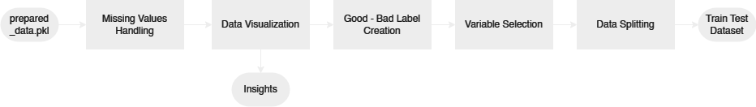

# IBRD Credit Scorecard Predictive Engine

An innovative solution for credit scoring, leveraging machine learning to predict credit risk, using The International Bank for Reconstruction and Development (IBRD) Loans dataset.

## Table of Contents

1. [Project Description](#project-description)
2. [Project Architecture](#project-architecture)
3. [Installation Guide](#installation-guide)
4. [Project Workflow](#project-workflow)
5. [Conclusions](#conclusions)
6. [Future Works](#future-works)
7. [References](#references)

## Project Description

In the financial industry, accurately assessing the risk associated with each loan is a crucial and persistent problem. The objective is to ensure financial stability and prevent loss by approving loans for those who are likely to repay them fully and on time. The business metric here is the accuracy of risk assessment which directly influences the approval/rejection of loans and ultimately the profit and loss.

To address this problem, we propose a machine learning solution: a credit scorecard system. We leverage the International Bank for Reconstruction and Development (IBRD) Loans dataset and use a Logistic Regression model to predict the credit risk associated with each loan. The machine learning metric we're most interested in is the model's ability to accurately predict 'bad' loans, i.e., the precision and recall for 'bad' loans.

## Project Architecture

The project's architecture has a structured folder layout for better organization and accessibility. The root directory consists of several sub-folders each dedicated for specific purposes. The project's folder structure would look like this:

```bash
.
├── data
│   ├── processed
│   └── raw
├── models
│   └── logs
├── notebooks
│   ├── 1_data_preparation
│   ├── 2_exploratory_data_analysis_and_preprocessing
│   ├── 3_feature_engineering
│   └── 4_model_training_and_evaluation
├── references
├── reports
│   └── figures
└── src
    ├── back_end
    │   └── config
    └── front_end
        └── config
```

## Installation Guide

This project utilizes Docker to manage the service environment. Here's a step-by-step guide to build the Docker image, create the Docker container, and run the service:

### Build The Docker Image

Open your terminal in the project root directory, and run the following command to build the Docker image:

```bash
docker build ibrd_credit_scorecar_predictive_engine .
```

### Create The Docker Container

Now, let's create a Docker container from the image we just built. Run the following command:

```bash
docker run 80:80 ibrd_credit_scorecard_predictive_engine_container ibrd_credit_scorecard_predictive_engine
```

Upon successfully creating the Docker container, your service should automatically be up and running. You can access it through the localhost port on your web browser with Streamlit. If you want to stop the service for any reason, you can use the following command:

```bash
docker stop ibrd_credit_scorecard_predictive_engine_container
```

### Run the Service

To start the service, use the following command in your terminal:

```bash
docker start ibrd_credit_scorecard_predictive_engine_container
```

You can now access the front-end of the service through the localhost port on your web browser with Streamlit. To interact with the service, fill in the required fields and click on the "Predict Score" button. The service will then return the credit score corresponding to the provided information.

### API Request Format

For those who want to interact with the backend directly, you can use applications like Postman and send a POST request to the API endpoint using the following JSON format:

```json
{
  "data": {
    "region": "EUROPE AND CENTRAL ASIA",
    "country": "Croatia",
    "guarantor": "No Guarantor",
    "loan_type": "BLNC",
    "principal_amount": 100000000
  }
}
```

### API Response Format

The API will respond with the predicted credit score in the following format:

```json
{
  "score": 448
}
```

## Project Workflow

The project follows a four-step process: Data Preparation, Exploratory Data Analysis & Preprocessing, Feature Engineering, and Modeling & Evaluation. Below, we provide a detailed overview of each step, accompanied by block diagrams for a better understanding.

### Dataset Information

The dataset we used originates from the International Bank for Reconstruction and Development (IBRD), and it contains data on public and publicly guaranteed debt extended by the World Bank Group. It includes key features such as Region, Country, Guarantor, Loan Type, and Original Principal Amount. For a more comprehensive understanding, please refer to the detailed dataset documentation accessible via this [link](references/DATASET.md).

### Data Preparation

Data Preparation involves checking data definition and data types validation. The prepared data then exported to .pkl format to ensures that there are no changes to the data types, which can often occur when using other formats.


### Exploratory Data Analysis & Preprocessing

The exploratory data analysis and preparation process started with removing columns containing more than 50% missing values and labeling loan statuses as 'good' or 'bad'. Preliminary data analysis was performed, including reviewing the dataset's time span and visualizing the data to gain insights. To understand the data's statistical properties, we conducted skewness analysis, chi-squared analysis, ANOVA F analysis, and correlation analysis. Based on these insights, variable selection was carried out by eliminating variables with high correlation. This resulted in a training and testing split of the dataset with a ratio of 70:30. Notably, no normalization was applied due to the intent to bin the data into categories in subsequent stages.



### Feature Engineering

During Feature Engineering, we refined the dataset by removing unused features, specifically those only relevant after a loan has been issued or granted. We wanted to keep the data applicable to pending loan applications. Additionally, we generated new features to enrich our dataset. Using techniques such as Information Value and Weight of Evidence, we observed trends and gauged feature importance. This knowledge allowed us to bin our features into different categories. Finally, to facilitate scorecard creation, we utilized one-hot encoding to transform categorical variables into a form that could be better utilized by machine learning algorithms.


### Modeling & Evaluation

In the Modeling & Evaluation phase, we started by training a baseline model using Logistic Regression. This model's performance provided us with a benchmark to gauge our progress. Subsequently, we optimized the model's hyperparameters with a Bayesian Search approach, combined with cross-validation, to ensure robustness and efficiency.

After optimizing the hyperparameters, we retrained the model and evaluated its performance again. In doing so, we observed improvements in model performance metrics like Accuracy, Precision, Recall, and AUC-ROC.

Finally, we transformed our fine-tuned model's outputs into a credit scorecard. This scorecard presents the predictive results in an easily interpretable way, essential for financial institutions to make informed decisions.


## Conclusions

- Implemented Logistic Regression to build a predictive model for loan risk assessment.
- Improved 'bad' loan detection through Bayesian Search cross-validation, overcoming initial overfitting in the baseline model.
- Though the final model's accuracy is slightly lower, its distinguishing capability between 'good' and 'bad' loans serves our core objective.

## Future Works

- Expand our dataset to improve balance.
- Explore different feature engineering approaches and models.
- Implement advanced techniques like ensemble learning or deep learning for enhanced predictions.

## References

This section lists all the references and resources utilized during the project.

[1] [Credit Scoring Methods: Latest Trends and Points to Consider](https://www.sciencedirect.com/science/article/pii/S2405918822000095)

[2] [Credit Scoring, Statistical Techniques and Evaluation Criteria: A Review of The Literature](https://www.researchgate.net/publication/220613924_Credit_Scoring_Statistical_Techniques_and_Evaluation_Criteria_A_Review_of_the_Literature)

[3] [Credit Risk Scorecard Estimation by Logistic Regression](https://core.ac.uk/reader/43337320)

[4] [Credit Scorecard Based on Logistic Regression with Random Coefficients](https://www.researchgate.net/publication/220308365_Credit_scorecard_based_on_logistic_regression_with_random_coefficients)

[5] [Mixed Credit Scoring Model of Logistic Regression and Evidence Weight in The Background of Big Data](https://www.researchgate.net/publication/332381614_Mixed_Credit_Scoring_Model_of_Logistic_Regression_and_Evidence_Weight_in_the_Background_of_Big_Data)
